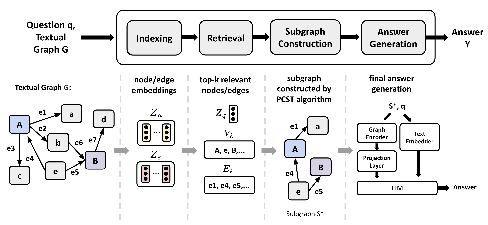

# Paper Implementation
# 🔎 G-Retriever: Retrieval-Augmented Generation for Textual Graph Understanding and Question Answering (Arxiv 2024)   
📑  Paper: [(link)](https://arxiv.org/pdf/2402.07630)  
💾  Original Repo: [(link)]([https://github.com/IDEA-FinAI/ToG](https://github.com/XiaoxinHe/G-Retriever))  

## 🌱 Contents
1. [Paper summary](#Summary)
2. [Pseudocode for implement](#Pseudocode)
3. [Module design](#Modules)
4. [Implementation details](#Implementation-Details)
5. [Discussion and opportunities for improvement](#Discussion-and-Opportunities-for-improvement)

## Summary
The paper introduces a new GraphQA benchmark for real-world graph question answering and present G-Retriever, an architecture adept at complex and creative queries. Experimental results show that G-Retriever surpasses baselines in textual graph tasks across multiple domains, scales effectively with larger graph sizes, and demonstrates resistance to hallucination.

## Pseudocode
**Input**: question \(q\), textual graph \(G\)
\[
\begin{aligned}
\{z_n\}, \{z_e\} &= \text{Indexing}(G) \quad \# \text{set of node and edge embeddings} \\
V_K', E_K' &= \text{Retriever}(q, \{z_n\}, \{z_e\}) \\
S^* &= \text{SubgraphConstructor}(V_K', E_K') \\
A &= \text{AnswerGenerator}(q, S^*)
\end{aligned}
\]
**Output**: answer \(A\)
This pseudocode is implemented using the modules described below:

## Modules

G-Retriever consists of four stages. First, it indexes the node and edge text attributes of a given textual graph to generate embeddings. Based on these embeddings, it constructs a subgraph composed of nodes and edges relevant to the given query. Finally, an LLM generates the final response using the subgraph and query as input prompts.

## Implementation Details
* Dataset: ExplaGraphs
* Metric: Exact Match Accuracy (Hits@1)
* Model: Llama2-7b(LLM), SentenceBert(encoder), Graph Transformer(graph encoder)

## Discussion and Opportunities for improvement 
- Subgraphs may be constructed inaccurately. A subgraph is selected based on the total score calculated from the similarity between node/edge embeddings and the query. However, while the total score may be high, it could include irrelevant elements or fail to include highly relevant ones.
- Elements necessary for response generation may have low relevance to the query (e.g., multi-hop reasoning).
- The model may fail to fully leverage the graph's structural (topological) information. Since only individual embeddings for nodes and edges are generated, the connectivity within the graph is not adequately captured.
